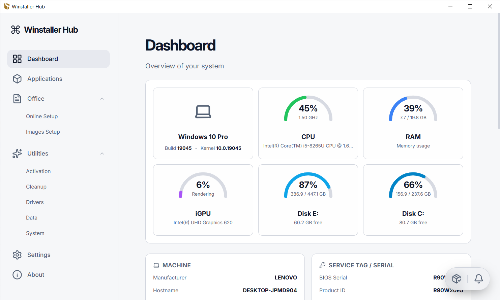
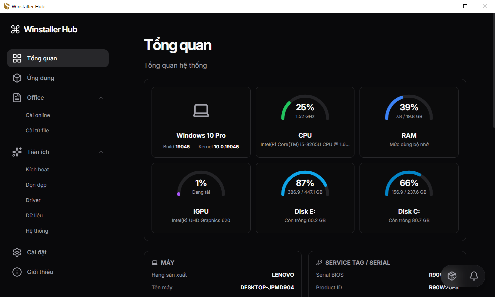
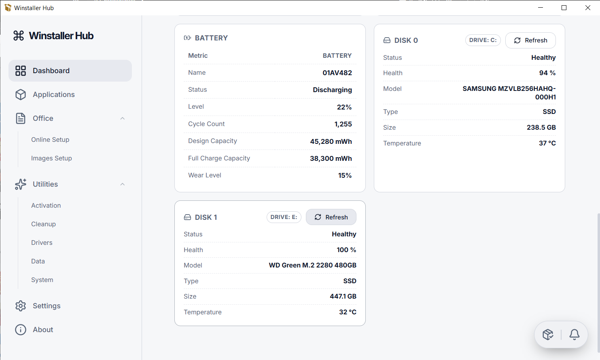
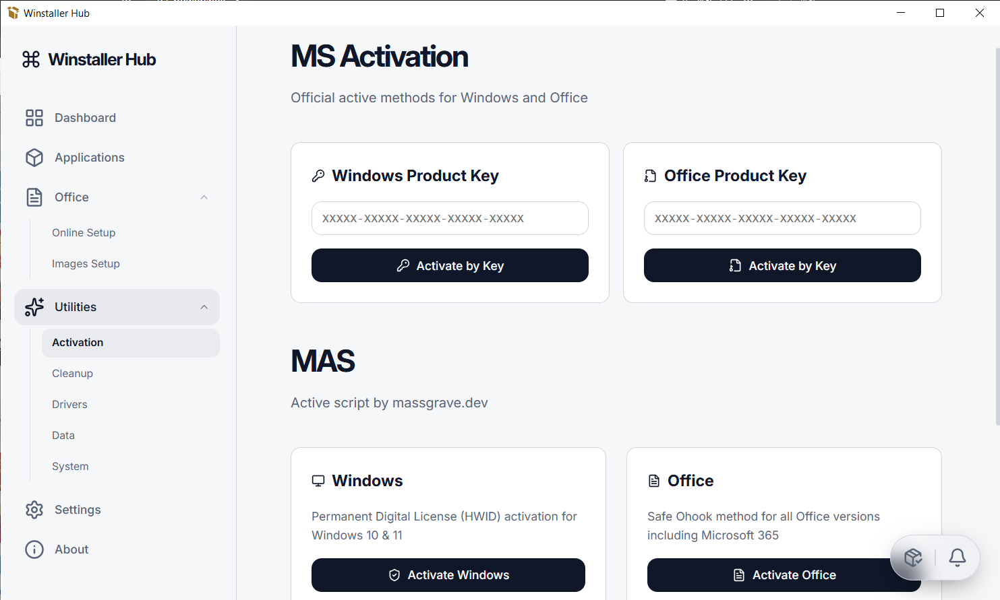
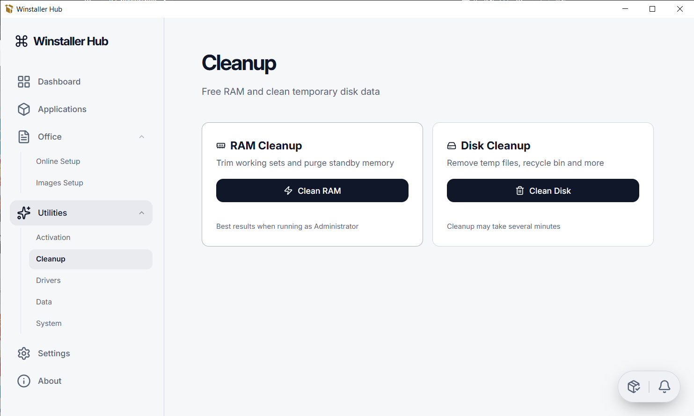

# Winstaller Hub

**Winstaller Hub** là một công cụ cài đặt ứng dụng Windows đa năng

| | |
|:---:|:---:|
|  |  |
|  |  |
|  |  |


## Tính năng

### Ứng dụng
- **Thêm bộ cài thủ công**: Thêm các tệp `.exe`, `.msi` mình thích vào
- **Tích hợp Winget**: Tìm kiếm và cài đặt các ứng dụng trực tiếp từ kho Winget
- **Cài đặt hàng loạt**: Chọn nhiều ứng dụng và cài đặt cùng lúc
- **Revo Uninstaller**: Truy cập nhanh vào Revo Uninstaller để gỡ bỏ ứng dụng sạch nhất

### Office
- **Bộ cài Office**: Cài đặt Office online hoặc từ file có sẵn
- **Clean Office**: Gỡ bỏ hoàn toàn các phiên bản Office cũ trước khi cài mới để tránh xung đột

### Tiện ích
- **Kích hoạt bản quyền**: Tích hợp công cụ MAS của massgrave.dev giúp kích hoạt Windows/Office nhanh chóng
- **Cleanup**: Dọn dẹp RAM, dọn dẹp thùng rác, dọn dẹp temp
- **Drivers**: Sao lưu và khôi phục các driver trên máy tính

## Hướng dẫn sử dụng

### Tải bản build sẵn về dùng luôn

1. Tải bản build sẵn của ứng dụng từ trang [Releases](https://github.com/mhqb365/Winstaller-Hub/releases)

2. Tải [Winget](https://drive.google.com/file/d/1c9MNzxv1qUIDaD1hzyQieWHjmu0Elkgg/view?usp=sharing) về và bỏ vào thư mục `apps/` để khi máy tính không có Winget thì sẽ tự động cài đặt từ file này

3. Tải [RevoUninstaller](https://drive.google.com/file/d/1elgbxk1mrWeGO9NCti_TqwV28wYL7sN8/view?usp=sharing) về giải nén và bỏ vào thư mục `apps/` để sử dụng tính năng gỡ cài đặt ứng dụng

4. Tải các bản cài đặt Office tại [https://massgrave.dev/office_c2r_links](https://massgrave.dev/office_c2r_links) về và bỏ vào thư mục `apps/Office` để sử dụng tính năng cài đặt Office từ file

### Hoặc clone code về tự build
- **Node.js**: Phiên bản 18.x trở lên
- **Hệ điều hành**: Windows 10/11

### Cài đặt môi trường
1. Sao chép project về máy
   ```bash
   git clone https://github.com/mhqb365/Winstaller-Hub.git
   cd Winstaller-Hub
   ```

2. Cài đặt các thư viện
   ```bash
   npm install
   ```

3. Chạy ứng dụng ở chế độ phát triển (Dev Mode)
   ```bash
   npm run dev
   ```

### Đóng gói ứng dụng
Để tạo bản `.exe` cho Windows:
```bash
npm run build:win
```

> From [mhqb365.com](https://mhqb365.com) with ❤